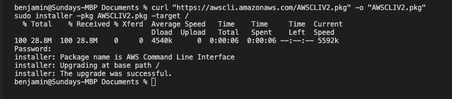
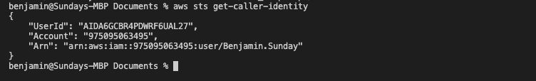
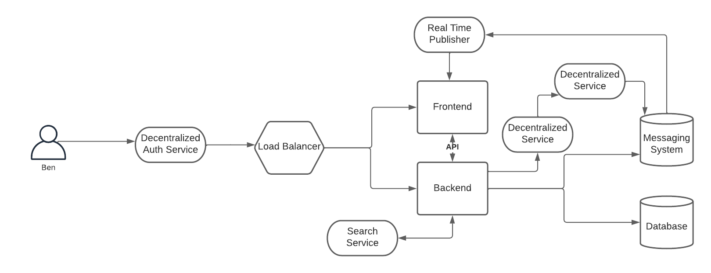
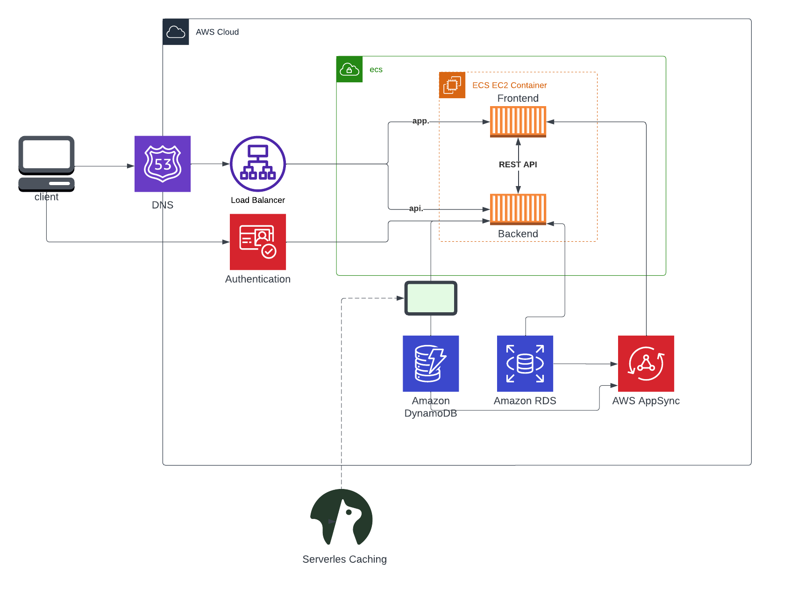

# Week 0 — Billing and Architecture

## Required Homework

#### Install and Verify AWS CLI

I was not able to use Gitpod or Github Codespaces due to browser issues
I used a local environment

In order to prove that I am able to use AWS CLI.
I am providing the instructions I used for configuring my local machine on an apple m1 mac

I did the following steps to install AWS CLI

I installed AWS CLI via **zsh**

I followed instructions on the [AWS CLI Documentation Page](https://docs.aws.amazon.com/cli/latest/userguide/getting-started-install.html)

```
curl "https://awscli.amazonaws.com/AWSCLIV2.pkg" -o "AWSCLIV2.pkg"
sudo installer -pkg AWSCLIV2.pkg -target /
```


I verified successful installation with
```
aws --version
```




## Recreate Conceptual Diagram in Lucid Charts or on a Napkin

[Conceptual Architectural Diagram](https://lucid.app/lucidchart/edde3444-5740-40b6-aad3-bc655310f216/edit?invitationId=inv_02fb0ae6-b829-4578-89de-fe8793bb6565)

## Recreate Logical Architectual Diagram in Lucid Charts

[Logical Architectural Diagram](https://lucid.app/lucidchart/422e1266-27a7-4bd2-bcf3-d6b2cfaab3f7/edit?invitationId=inv_2299a8f3-16f2-463c-a2dc-defca5716615)

## Homework Challenges
