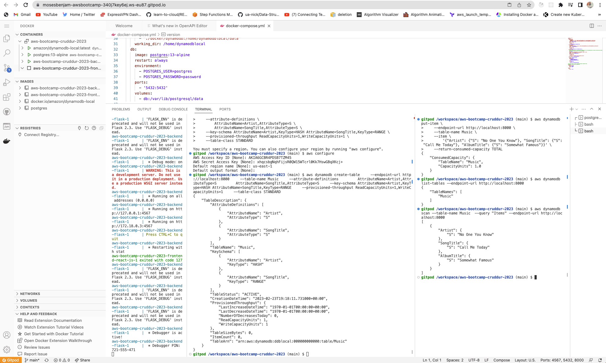
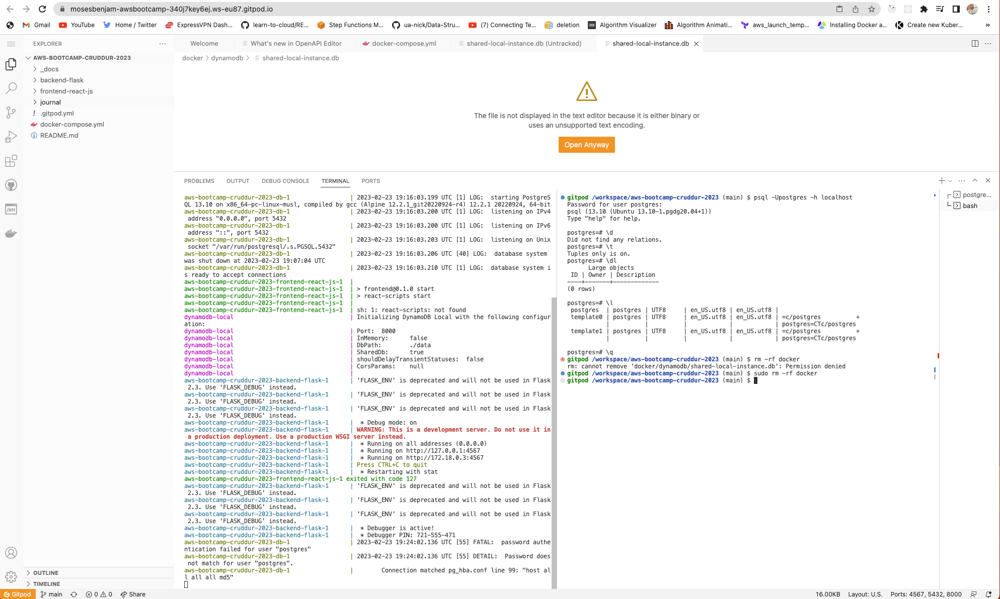
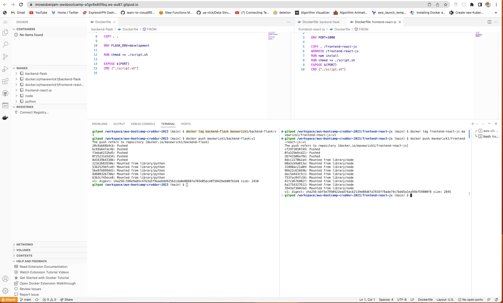
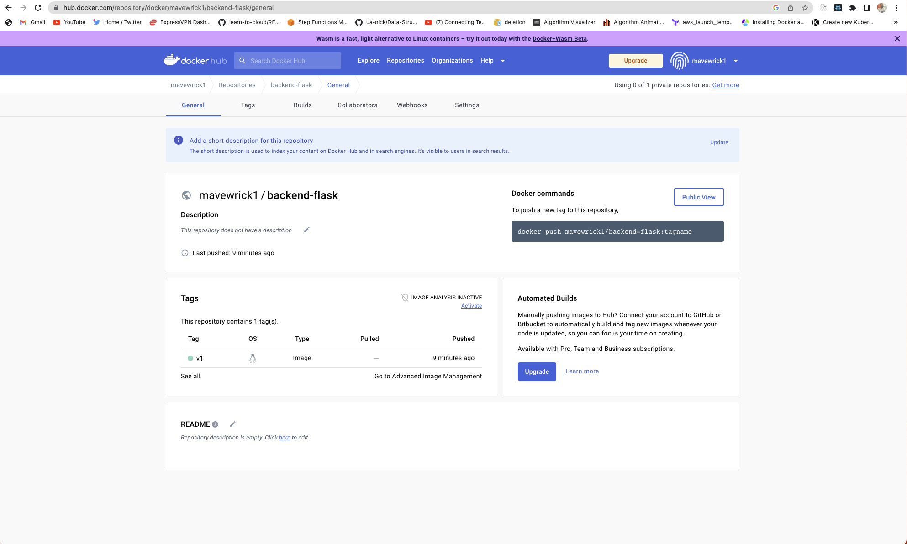
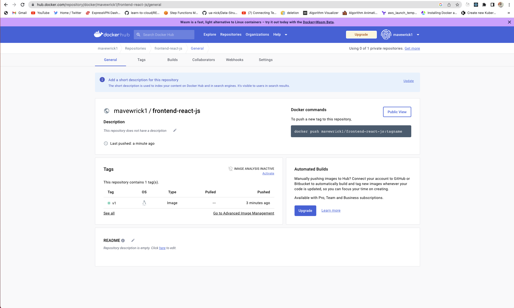

# Week 1 — App Containerization

## Required Homework

### Containerize Application (Dockerfiles, Docker Compose)
[Containerized application backend](https://github.com/mosesbenjamin/aws-bootcamp-cruddur-2023/blob/main/backend-flask/Dockerfile)

[Containerized application frontend](https://github.com/mosesbenjamin/aws-bootcamp-cruddur-2023/blob/main/frontend-react-js/Dockerfile)

[Docker compose file at the root of the project](https://github.com/mosesbenjamin/aws-bootcamp-cruddur-2023/blob/main/docker-compose.yml)

### Document the Notification Endpoint for the OpenAI Document
[Notification endpoint for OpenAPI doc](https://github.com/mosesbenjamin/aws-bootcamp-cruddur-2023/blob/main/backend-flask/openapi-3.0.yml#:~:text=/api/activities/notifications,schemas/Activity%27)

### Write a Flask Backend Endpoint for Notifications
[Notifications Activities service](https://github.com/mosesbenjamin/aws-bootcamp-cruddur-2023/blob/main/backend-flask/services/notifications_activities.py)

### Write a React Page for Notifications
[Notifications Feed Page](https://github.com/mosesbenjamin/aws-bootcamp-cruddur-2023/blob/main/frontend-react-js/src/pages/NotificationsFeedPage.js)

### Run DynamoDB Local Container and ensure it works

### Run Postgres Container and ensure it works

## Homework Challenges

### Run the dockerfile CMD as an external script
[Backend Dockerfile](https://github.com/mosesbenjamin/aws-bootcamp-cruddur-2023/blob/main/backend-flask/Dockerfile)

[Backend script file](https://github.com/mosesbenjamin/aws-bootcamp-cruddur-2023/blob/main/backend-flask/script.sh)

[Frontend Dockerfile](https://github.com/mosesbenjamin/aws-bootcamp-cruddur-2023/blob/main/frontend-react-js/Dockerfile)

[Frontend script file](https://github.com/mosesbenjamin/aws-bootcamp-cruddur-2023/blob/main/frontend-react-js/script.sh)

### Push and tag a image to DockerHub (they have a free tier)

### Use multi-stage building for a Dockerfile build

(remember to add proof)
