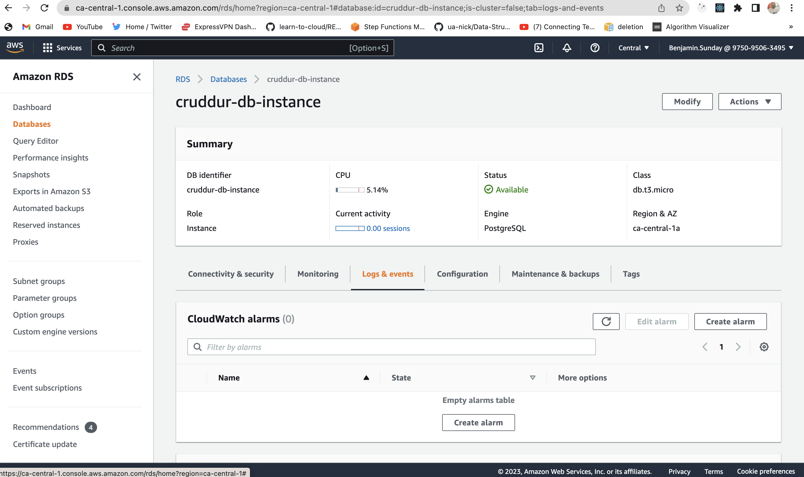
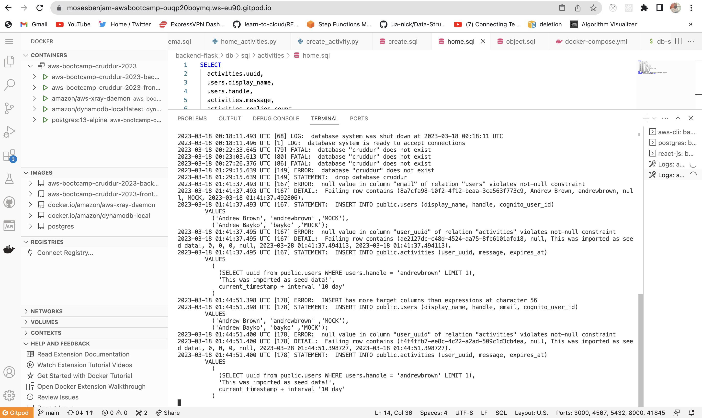
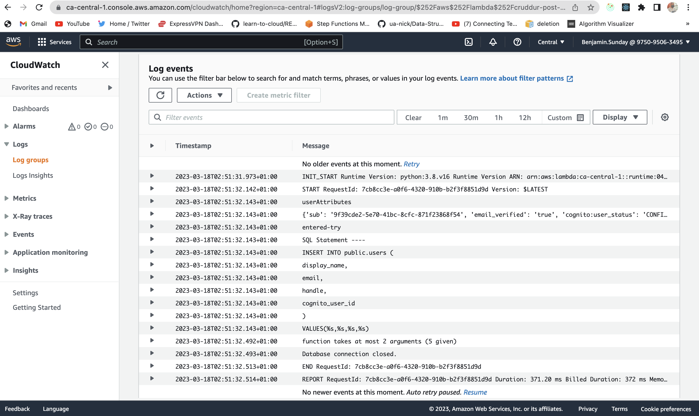
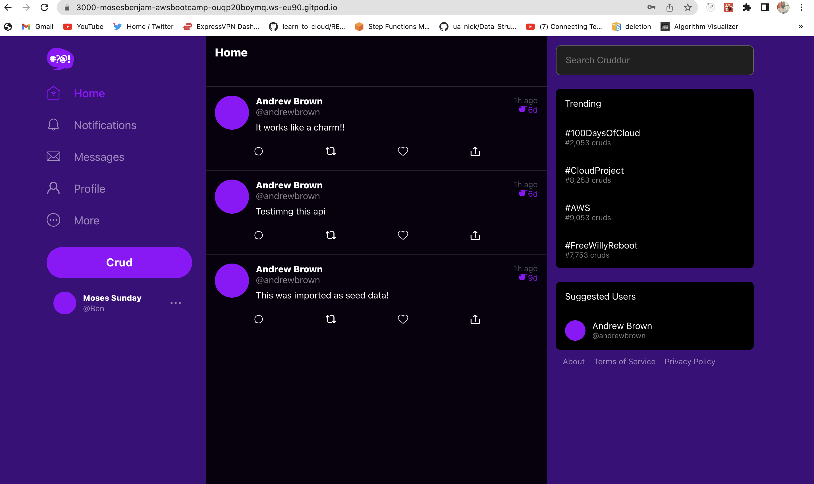

# Week 4 — Postgres and RDS

## Required Homework

### Create RDS Postgres Instance

### Bash scripting for common database actions
[Bash scripting for common database actions](https://github.com/mosesbenjamin/aws-bootcamp-cruddur-2023/tree/main/backend-flask/bin)

### Install Postgres Driver in Backend Application
[Install Postgres Driver in Backend Application](https://github.com/mosesbenjamin/aws-bootcamp-cruddur-2023/blob/main/backend-flask/requirements.txt#:~:text=psycopg%5Bbinary%5D,psycopg%5Bpool%5D)

### Connect Gitpod to RDS Instance

### Create Congito Trigger to insert user into database

### Create new activities with a database insert

