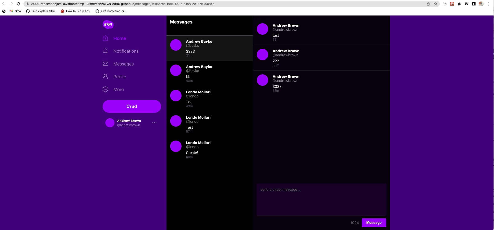
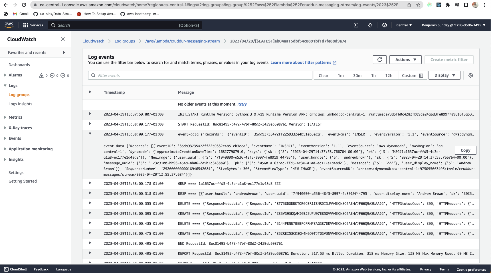

# Week 5 — DynamoDB and Serverless Caching

## Required Homework

### DynamoDB Utility Scripts
[DynamoDB Utility Scripts](https://github.com/mosesbenjamin/aws-bootcamp-cruddur-2023/tree/main/backend-flask/bin/ddb)

### Implement Conversations with DynamoDB

### DynamoDB Stream

