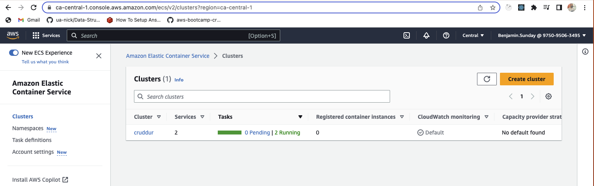
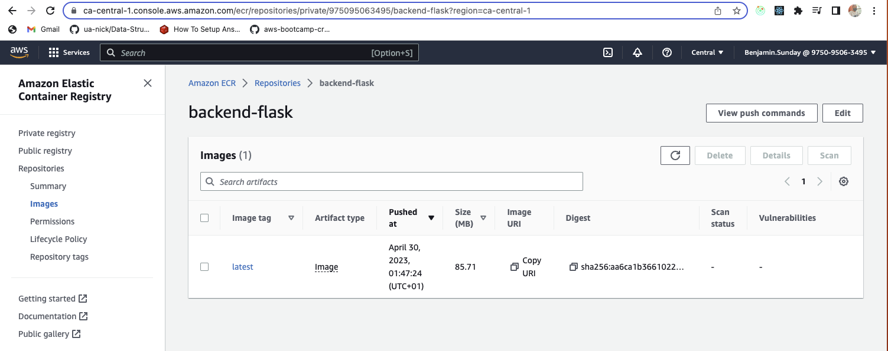
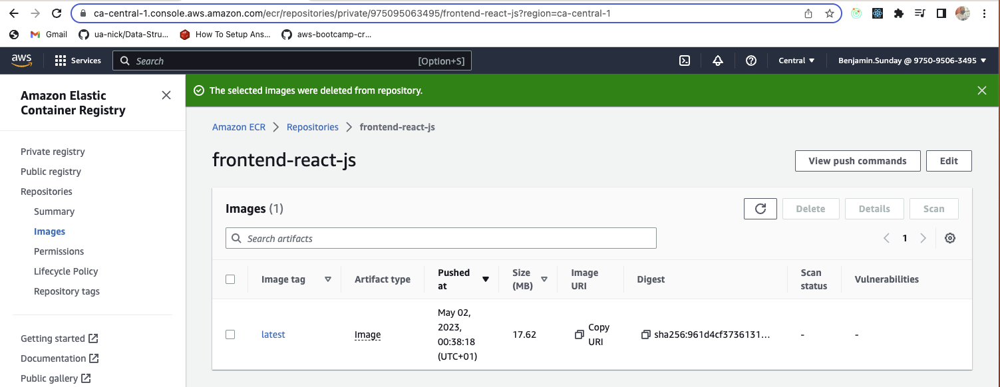
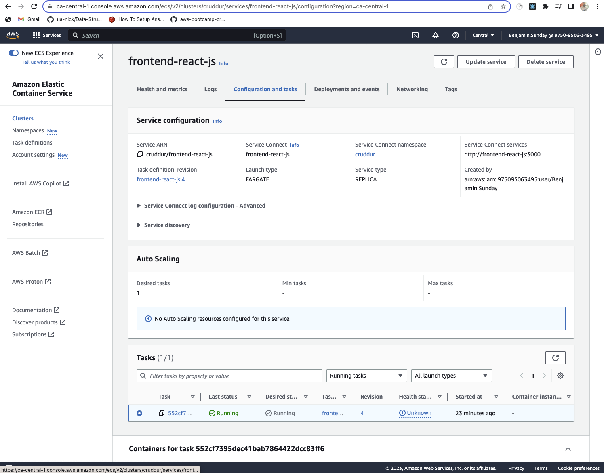

# Week 6 — Deploying Containers

## Required Homework

### Provision ECS Cluster

### Create ECR repo and push image for backend-flask

### Deploy Backend Flask app as a service to Fargate

### Create ECR repo and push image for fronted-react-js

### Deploy Frontend React JS app as a service to Fargate

### Secure Flask by not running in debug mode
[Turn debug mode off in prod](https://github.com/mosesbenjamin/aws-bootcamp-cruddur-2023/blob/main/backend-flask/Dockerfile.prod#:~:text=CMD%20%5B%20%22python3%22%2C%20%22%2Dm%22%20%2C%20%22flask%22%2C%20%22run%22%2C%20%22%2D%2Dhost%3D0.0.0.0%22%2C%20%22%2D%2Dport%3D4567%22%2C%20%22%2D%2Dno%2Ddebug%22%2C%22%2D%2Dno%2Ddebugger%22%2C%22%2D%2Dno%2Dreload%22%5D)

### Implement Refresh Token for Amazon Cognito
[Referesh Token](https://github.com/mosesbenjamin/aws-bootcamp-cruddur-2023/blob/main/frontend-react-js/src/lib/CheckAuth.js#:~:text=router%2Ddom%27%3B-,export%20async%20function%20getAccessToken()%7B,%7D,-export%20async%20function)

### Refactor bin directory to be top level
[Bin directory](../bin)

### Configure task defintions to contain x-ray and turn on Container Insights
[Frontend](https://github.com/mosesbenjamin/aws-bootcamp-cruddur-2023/blob/main/aws/task-definitions/frontend-react-js.json#:~:text=%22containerDefinitions%22%3A%20%5B-,%7B,%7D%2C,-%7B)

[Backend](https://github.com/mosesbenjamin/aws-bootcamp-cruddur-2023/blob/main/aws/task-definitions/backend-flask.json#:~:text=%22containerDefinitions%22%3A%20%5B-,%7B,%7D%2C,-%7B)

### Change Docker Compose to explicitly use a user-defined network
[docker-compose.yml](https://github.com/mosesbenjamin/aws-bootcamp-cruddur-2023/blob/main/docker-compose.yml#:~:text=the%20image%20names-,networks%3A,name%3A%20cruddur%2Dnet,-volumes%3A)

### Create Dockerfile specfically for production use case
[Frontend](../frontend-react-js/Dockerfile.prod)

[Backend](../backend-flask/Dockerfile.prod)

### Using ruby generate out env dot files for docker using erb templates
[For generating dotenv files](../erb)
